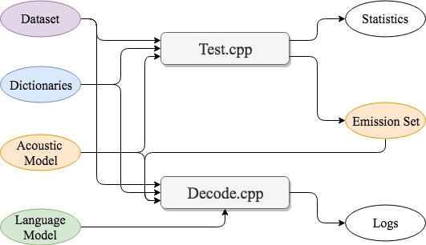

## Introduction


### Major Components

* The **test** binary is used to compute basic statistics like letter error rate
  (LER) and word error rate (WER) given an acoustic model (AM) using the greedy best
  path without the constraints of lexicon or language model (LM). It will
  also generate an **Emission Set** including the emission matrix as well as other
  target-related information for each sample so that the **Emission Set** can be
  fed into the decoder directly to generate transcripts without running AM
  forwarding again.
* The **decode** binary is a beam search decoder that attempts to find for each
  sample the best transcript that minimizes WER using an external LM.
  It can take as input either an emission set generated from the test binary, or
  an AM to generate emissions at runtime. We suggest generating the
  **Emission Set** before decoding if running a hyper-parameter search over the
  same dataset.

### Things you need to know
* Types of decoders:
  * Word-LM or Token-LM?
    * If `-decodertype` flag is set to `wrd` (by default),
    then the decoder will query the word-level LM only when it proposes a valid
    word in the lexicon.
    * Otherwise, if set to `tkn`, the decoder will
    query the token-level LM each time a new token is proposed into the
    transcript.
    * In principle, unigrams in the token LM should match with the
    tokens used in AM training, while the unigrams in the word LM are valid
    words already, and a lexicon is requested to map those words into spellings,
    i.e. a sequence of AM tokens.
  * Lexicon or Lexicon-free?
    * If `-lexicon` flag is specified, i.e. a lexicon is
    provided to the decoder, then the decoder will only generate words
    that are present in the lexicon.
    * Otherwise, all possible combinations of tokens may
    appear in the final transcript, and the final word sequence will be
    determined by splitting the transcripts with token `-wordseparator`.
    * Note that the lexicon-free decoder only works with token-level LM because
    lexicon-free decoding has no notion of a set of valid words.
  * Seq2Seq: If `-criterion` flag is set to `seq2seq`, seq2seq decoder will be
    used. Note that the current implementation of seq2seq decoder only supports
    lexicon-free decoding with token-level LM.
* Types of language models:
  * KenLM: We are using the [KenLM toolkit](https://kheafield.com/code/kenlm/)
    for n-gram LMs.
  * ConvLM: We also implemented the [Convolutional Language Model](https://arxiv.org/abs/1812.06864)
    using [flashlight](https://github.com/facebookresearch/flashlight) and it is
    incorporated into the decoder.
* Lexicon: The set of allowed words and their possible spellings used by the
  decoder. Each line is a word and spelling pair that are separated by a tab.
  The spelling is represented by a space-separated sequence of tokens. An
  example entry could be `apple	a p p l e |`, where the pipe `|` at the end
  should be the same as `-wordseparator` used in AM training. Note that the same
  word may have multiple spellings; these should be on separate lines. To better
  utilize the decoder, the spellings in the lexicon should match with the ones
  used during AM training. For example, if we mapped `I like Hello-kitty` to
  `| i | l i k e | h e l l o | k i t t y |` during AM training, we would better
  have `h e l l o | k i t t y |` as the spelling of word `Hello-kitty`.
* Emission Set:
  * `emissions`: A vector of column-major T x N floating-point matrices of
    AM scores (e.g. log-probabilities) for each sample. T is the number of
    output frames and N is the number of tokens.
  * `wordTargets`: Word targets in string of each sample.
  * `tokenTargets`: Token targets in indices of each sample.
  * `sampleIds`: Sample IDs in string of each sample.
  * `transition`: (optional) If AM is trained with ASG criterion, this is the
    N x N floating-point transition matrix.
  * `emissionT`: The number of output frames T for each sample
  * `emissionN`: The number of tokens N
  * `gflags`: All the flags we used for training and testing
* LER: Letter error rate usually represents token error rate, where the `token`s
  are the smallest unit we specified as target during training. If we set the
  `-usewordpiece` flag to be true, then LER will be computed on the
  single-letter sequence after each word-piece is split.
* Online decoding: Decoders, except seq2seq decoder, are now supporting online
  decoding, which may consume small chunks of emissions of audio as input. At
  the time we want to have a look at the transcript so far, we may get the
  best transcript and prune the hypothesis space and keep decoding further.


## Running scripts

### Test

```
<test_cpp_binary> \
-am <path/to/acoustic_model.bin> \
-emission_dir <path/to/emission_dir/> \
-test <path/to/testset/> \
-maxload -1 \
-show
```

We load the AM and its flags/configuration based on the `-am` flag. We
will reuse things like `-datadir` and `-tokens` from it. But it is also possible
to override the flags from command line. `-emission_dir` specifies the path to
the directory we save the `Emission Set`. The flags `-datadir` and `-test` are
concatenated to specify the datasets we want to run experiments on. Note that we
can test on more than 1 dataset, they must be in the same `-datadir` and are
specified as a comma-separated list to `test`.

### Decode
When decoding ASG/CTC models, we just need to specify one of the `-am` and
`-emission_dir` flags, because once we get the emissions we will never use the
AM again. But for Seq2seq decoder, `-am` is required, since we need the RNN
decoder part during beam search. The flag `-sclite` specifies the path to save
the logs, including the *stdout* log and the hypotheses and references in
*sclite* format ([trn](http://www1.icsi.berkeley.edu/Speech/docs/sctk-1.2/infmts.htm#trn_fmt_name_0)).
Note that AM type, as well as other things we specified for AM training, can be
inferred from `-am` or **Emission Set**.

Below are commands to decode with different types of decoders. Please refer to
[here](https://github.com/facebookresearch/wav2letter/blob/master/src/common/Defines.cpp)
for the detailed meaning of each flag.

#### Lexicon + Word-LM (Using `-am`)
```
<decode_cpp_binary> \
-lexicon <path/to/words.txt> \
-am <path/to/acoustic_model.bin> \
-lm <path/to/word_language_model.bin> \
-test <path/to/testset/> \
-sclite <path/to/save/logs/> \
-lmweight 4 \
-wordscore 2.2 \
-maxload 50 \
-beamsize 2500 \
-beamthreshold 100 \
-silweight -1 \
-nthread_decoder 8 \
-smearing max \
-show \
-showletters
```

#### Lexicon + Word-LM (Using `-emission_dir`)
```
<decode_cpp_binary> \
-lexicon <path/to/words.txt> \
-emission_dir <path/to/emission_dir/> \
-lm <path/to/word_language_model.bin> \
-test <path/to/testset/> \
-sclite <path/to/save/logs/> \
-lmweight 4 \
-wordscore 2.2 \
-maxload 50 \
-beamsize 2500 \
-beamthreshold 100 \
-silweight -1 \
-nthread_decoder 8 \
-smearing max \
-show \
-showletters
```

#### Lexicon + Token-LM
```
<decode_cpp_binary> \
-lexicon <path/to/words.txt> \
-am <path/to/acoustic_model.bin> \
-lm <path/to/token_language_model.bin> \
-test <path/to/testset/> \
-sclite <path/to/save/logs/> \
-decodertype tkn \
-lmweight 4 \
-wordscore 2.2 \
-maxload 50 \
-beamsize 2500 \
-beamthreshold 100 \
-silweight -1 \
-nthread_decoder 8 \
-smearing max \
-show \
-showletters
```

#### Lexicon-free + Token-LM
```
<decode_cpp_binary> \
-lexicon "" \
-am <path/to/acoustic_model.bin> \
-lm <path/to/token_language_model.bin> \
-test <path/to/testset/> \
-sclite <path/to/save/logs/> \
-decodertype tkn \
-lmweight 4 \
-wordscore 2.2 \
-maxload 50 \
-beamsize 2500 \
-beamthreshold 100 \
-silweight -1 \
-nthread_decoder 8 \
-smearing max \
-show \
-showletters
```

#### Seq2Seq + Token-LM
```
<decode_cpp_binary> \
-am <path/to/acoustic_model.bin> \
-emission_dir <path/to/emission_dir/> \
-lm <path/to/token_language_model.bin> \
-test <path/to/testset/> \
-sclite <path/to/save/logs/> \
-decodertype tkn \
-beamsize 80 \
-beamthreshold 7 \
-lmweight 1.0 \
-wordscore 2.0 \
-smoothingtemperature 1.0 \
-hardselection 1.5 \
-softselection 10.0 \
-attentionthreshold 30 \
-smearing max \
-show \
-showletters
```

#### Decoding with ConvLM
To decode with ConvLM, all you need to add for the above commands are:
* `-lmtype convlm`
* `-lm_vocab <path/to/convlm_vocabulary_dict.txt>`
* `-lm_memory 5000`

`-lmtype`, whose default value is `kenlm`, is used to specify the type of LM.
`-lm_vocab` specified a dictionary that was used to map tokens
into indices in LM training. Its format is similar to `-tokens`
where each line is a single token (char, word, word-piece, etc.) and the token
index is exactly its line number.

To efficiently decode with ConvLM, which is pretty expensive on running the
forward pass, we design a dynamic cache to hold the probabilities over all the
tokens given the candidates generated from the previous frame. This way, when we
want to propose new candidates during beam search, we can easily check the
cache for its pre-computed LM score. In other words, we only need to run the
ConvLM forward pass in batch at the end of decoding each frame, when all the
possible new candidates are gathered. Thus, the batching and caching can greatly
reduce the number of the forward passes we need to run in total.

Usually, the cache has size `beam size` x `number of classes in ConvLM` in main
memory. If we cannot feed `beam size` samples to ConvLM in a single batch,
`-lm_memory` is used to limit the size of input batch. `-lm_memory` is a integer
which requires `input batch size` x `LM context size` < `-lm_memory`. For
example, if the context size or receptive field of a ConvLM is 50, then
no matter what the beam size is, we can only feed 100 samples in a single batch
if `-lm_memory` is set to `5000`.

[Coming soon: How to serialize ConvLM models trained in fairseq]
