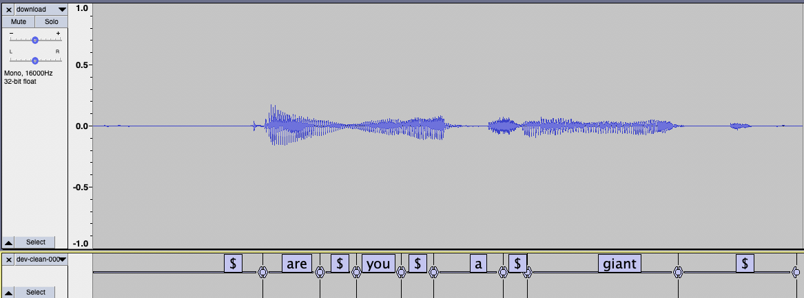

# Aligning text to speech using acoustic models

This is a tutorial on how to force align text to speech with acoustic models using wav2letter++.
Force Alignment is a process which takes an audio sample and text target as an input, and outputs the time segments in the audio sample that corresponds to each word in the target.

### Step 1: Obtain a trained acoustic model

To train your own model, please follow the steps outlined [here](https://github.com/facebookresearch/wav2letter/tree/master/tutorials/1-librispeech_clean)

Pretrained models can also be found [here](https://github.com/facebookresearch/wav2letter/blob/master/recipes/models/lexicon_free/librispeech/README.md#acoustic-model).

### Step 2: Run alignment

** Note: For alignment to work properly, it must be ran using the same tokens and criterion it was trained with **

First, create a flags file to configure the alignment. For the pretrained model above, the flags file would be:

```
# align.cfg
# Replace MODEL\_DST and DATA\_DST with the locations of the model (downloaded from above) and data respectively.
--tokensdir=[MODEL_DST]
--tokens=tokens.lst
--lexicon=[MODEL_DST]/lexicon.lst
--am=[MODEL_DST]/baseline_dev-clean+other.bin
--datadir=[DATA_DST]
# test refers to the samples we will perform alignment on
--test=dev-clean.lst
```

Run alignment and write alignments to alignments.txt

```shell
# Replace [...] with appropriate paths of build and wav2letter
> [...]/wav2letter/build/tools/Align alignments.txt --flagsfile align.cfg
```

### Step 3: Visualize using Audacity

Audacity is an open source audio platform.
We can use audacity to visualize the output of alignments.
To download audacity, please visit [here](https://www.audacityteam.org/)

First, we need to convert the output to Audacity's label format.
There's a small utility script located at `tools/alignment/convertToAudacityLabels.py`
This script will create a label file for each sample in the test set.

```shell
> python3 tools/alignment/convertToAudacityLabels.py -f alignments.txt -o labels/
> ls labels
dev-clean-000001584  dev-clean-000002703  ....
```

Open one of the flac files for the labels located in `labels` using audacity. (dev-clean-000001584 contains the alignment for the flac file in [DATA_DST]/dev-clean/000001584.flac).

Import the label file into audacity:
File > Import > Label...

You should now be able to inspect the aligned text with the audio.


