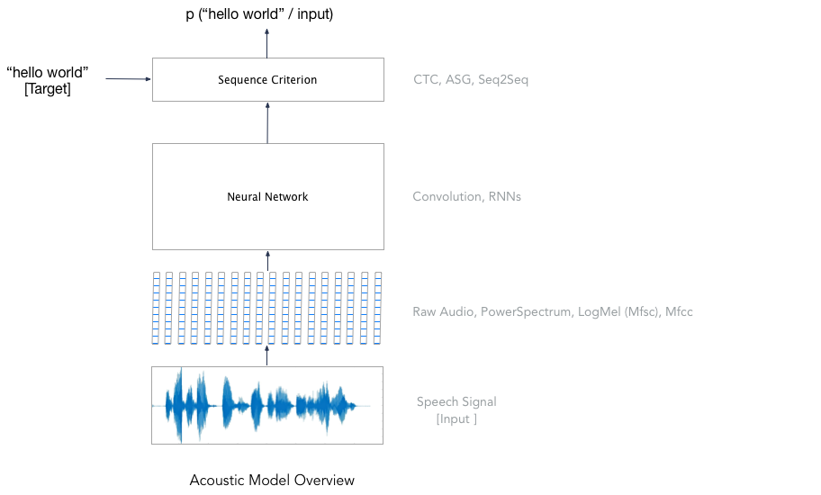

# E2E Speech Recognition on Librispeech-Clean Dataset

This is a step-by-step tutorial on how to build a simple end-to-end speech recognition system using wav2letter++.
We will use "clean" speech subset of [Librispeech](http://www.openslr.org/12) corpus.
The dataset consists of read English speech (sampled at 16KHz) from public domain audio books.

### Step 1: Data Preparation

For a speech recognition dataset, we usually have access to a set of audio files and their transcriptions. Create an experiment path and download the dataset.

```shell
> W2LDIR=/home/$USER/w2l # or any other path where you want to keep the data
> mkdir -p $W2LDIR
> wget -qO- http://www.openslr.org/resources/12/train-clean-100.tar.gz | tar xvz -C $W2LDIR
> wget -qO- http://www.openslr.org/resources/12/dev-clean.tar.gz | tar xvz -C $W2LDIR
> wget -qO- http://www.openslr.org/resources/12/test-clean.tar.gz | tar xvz -C $W2LDIR
```


After this step, the directory structure of `$W2LDIR` should look like this

```shell
> tree $W2LDIR --filelimit 20
# /home/vineelkpratap/w2l
# └── LibriSpeech
#     ├── BOOKS.TXT
#     ├── CHAPTERS.TXT
#     ├── dev-clean [40 entries exceeds filelimit, not opening dir]
#     ├── LICENSE.TXT
#     ├── README.TXT
#     ├── SPEAKERS.TXT
#     ├── test-clean [40 entries exceeds filelimit, not opening dir]
#     └── train-clean-100 [251 entries exceeds filelimit, not opening dir]
```

`train-clean-100`, `dev-clean`, `test-clean` folders consists of audio files and
their transcripts for train, validation  and test sets respectively.

```shell
> ls $W2LDIR/LibriSpeech/train-clean-100/32/21631/
# 32-21631-0000.flac  32-21631-0003.flac  32-21631-0006.flac  32-21631-0009.flac  32-21631-0012.flac  32-21631-0015.flac  32-21631-0018.flac
# 32-21631-0001.flac  32-21631-0004.flac  32-21631-0007.flac  32-21631-0010.flac  32-21631-0013.flac  32-21631-0016.flac  32-21631-0019.flac
# 32-21631-0002.flac  32-21631-0005.flac  32-21631-0008.flac  32-21631-0011.flac  32-21631-0014.flac  32-21631-0017.flac  32-21631.trans.txt
# `***.trans.txt` in each folder has the transcripts for all the `.flac` audio files present.
```

Before preparing the dataset, we need to decide the sub-word units to be used for training the acoustic model (mode details on acoustic model later). These could be [phonemes](https://en.wikipedia.org/wiki/Phoneme), [graphemes](https://en.wikipedia.org/wiki/Grapheme), word-pieces etc. Each word is represented as a sequence of these chosen sub-word units. In this tutorial, we will use graphemes as the sub-word unit.

Now, we will preprocess this dataset into a format which wav2letter++ pipelines can process. Given training, validation and test sets, we will keep each set in a separate file with each line corresponding to a single sample. You can find more details about dataset preparation [here](https://github.com/facebookresearch/wav2letter/wiki/Data-Preparation).

```shell
> pip install sox

> wav2letter/tutorials/librispeech_clean/prepare_data.py --src $W2LDIR/LibriSpeech/ --dst $W2LDIR

> wav2letter/tutorials/librispeech_clean/prepare_lm.py --dst $W2LDIR
```

Explore the dataset created

```shell
> tree $W2LDIR --filelimit 20
# .
# ├── am
# │   ├── lexicon.txt
# │   └── tokens.txt
# ├── LibriSpeech
# │   ├── BOOKS.TXT
# │   ├── CHAPTERS.TXT
# │   ├── dev-clean [40 entries exceeds filelimit, not opening dir]
# │   ├── LICENSE.TXT
# │   ├── README.TXT
# │   ├── SPEAKERS.TXT
# │   ├── test-clean [40 entries exceeds filelimit, not opening dir]
# │   └── train-clean-100 [251 entries exceeds filelimit, not opening dir]
# ├── lists
# │   ├── dev-clean.lst
# │   ├── test-clean.lst
# │   └── train-clean-100.lst
# └── lm
#     ├── 3-gram.arpa
#     └── lexicon.txt
#
# 7 directories, 12 files
```

### Step 2: Training the Acoustic Model

During [acoustic model](https://en.wikipedia.org/wiki/Acoustic_model) training, we will train a neural network which learns the relationship between the graphemes and input audio.



##### Feature Extraction
wav2letter++ currently supports multiple audio file formats (e.g. wav, flac... / mono, stereo / int, float) and several feature types including the raw audio, a linearly scaled power spectrum , log-Mels (MFSC) and MFCCs. The features are computed on the fly prior to each network evaluation. For this tutorial, we will use [MFCC features](http://practicalcryptography.com/miscellaneous/machine-learning/guide-mel-frequency-cepstral-coefficients-mfccs/) which can be specified using the gflag `-mfcc`.

##### Defining the Neural Network
wav2letter++ provides an easy way to define `fl::Sequential` module using `-arch` and `-archdir` flags. This makes it easier to explore different network architectures with a single binary. It is also possible plugin your own custom network by defining new `fl::Module`. More details on specifying the architecture files [here](https://github.com/facebookresearch/wav2letter/wiki/Writing-architecture-files).

For this tutorial, we will use the following neural network with 8 Temporal Convolutions followed by 2 Linear layers with ReLU activations.

```
# network.arch
# Input Shape - TIMEFRAMES x NFEAT x NCHANNEL x BATCHSIZE
V -1 1 NFEAT 0   		# fl::View layer to convert input to appropriate shape for temporal convolution. NFEAT is replaced with appropriate feature dimension size at runtime.
C2 NFEAT 256 8 1 2 1 -1 -1      # Temporal Convolution with output channels = 256, filter size = 8, stride = 2 and “SAME” padding
R
C2 256 256 8 1 1 1 -1 -1
R
C2 256 256 8 1 1 1 -1 -1
R
C2 256 256 8 1 1 1 -1 -1
R
C2 256 256 8 1 1 1 -1 -1
R
C2 256 256 8 1 1 1 -1 -1
R
C2 256 256 8 1 1 1 -1 -1
R
C2 256 256 8 1 1 1 -1 -1
R
RO 2 0 3 1			# fl::Reorder Layer to convert input to appropriate shape for Linear layer
L 256 512			# fl::Linear Layer with 256 input channels and 512 output channels.
R
L 512 NLABEL			# NLABEL is replaced with appropriate token size at runtime.
```

##### Choosing the Loss Criterion
wav2letter++ supports many end-to-end sequence models such as ConnectionistTemporalClassification, AutoSegmentationCriterion and Sequence-to-Sequence models with attention. For this tutorial, we will use [Connectionist Temporal Classification](https://distill.pub/2017/ctc/)  Loss which is specified using `-ctc` flag.

##### Training the Model
Documentation on training the models with wav2letter++  can be found [here](https://github.com/facebookresearch/wav2letter/wiki/Train-a-model). To start training

```shell
# Replace [...] with appropriate paths in train.cfg before starting
> [...]/wav2letter/build/Train train --flagsfile [...]/wav2letter/tutorials/librispeech_clean/train.cfg
# ...
# ...
# ...
# ...
# ...
# ...
# I0821 10:00:13.362344 1587002 Train.cpp:510] Shuffling trainset
# I0821 10:00:13.362879 1587002 Train.cpp:517] Epoch 1 started!
# I0821 10:08:34.901075 1587002 Train.cpp:313] epoch:        1 | lr: 0.100000 | lrcriterion: 0.000000 | runtime: 00:08:11 | bch(ms): 68.88 | smp(ms): 0.31 | fwd(ms): 51.86 | crit-fwd(ms): 46.20 | bwd(ms): 13.88 | optim(ms): 1.54 | loss:   27.76495 | train-TER: 64.47 | train-WER: 98.16 | lists/dev-clean.lst-loss:   13.86542 | lists/dev-clean.lst-TER: 45.20 | lists/dev-clean.lst-WER: 90.04 | avg-isz: 1267 | avg-tsz: 213 | max-tsz: 400 | hrs:  100.47 | thrpt(sec/sec): 735.99
# I0821 10:08:36.011454 1587002 Train.cpp:510] Shuffling trainset
# I0821 10:08:36.012792 1587002 Train.cpp:517] Epoch 2 started!
# I0821 10:16:57.047940 1587002 Train.cpp:313] epoch:        2 | lr: 0.100000 | lrcriterion: 0.000000 | runtime: 00:08:11 | bch(ms): 68.87 | smp(ms): 0.33 | fwd(ms): 51.78 | crit-fwd(ms): 46.28 | bwd(ms): 13.81 | optim(ms): 1.46 | loss:   16.06979 | train-TER: 38.11 | train-WER: 85.46 | lists/dev-clean.lst-loss:   10.77253 | lists/dev-clean.lst-TER: 34.69 | lists/dev-clean.lst-WER: 81.71 | avg-isz: 1267 | avg-tsz: 213 | max-tsz: 400 | hrs:  100.47 | thrpt(sec/sec): 736.07
# I0821 10:16:57.164841 1587002 Train.cpp:510] Shuffling trainset
# I0821 10:16:57.165771 1587002 Train.cpp:517] Epoch 3 started!
# ...
# ...
# ...
# ...
```

Train the model for 25 epochs (specified by `-iter` flag) and check the run
directory (specified by `-rundir`, `-runname` gflags) for logs.
You can also stop training early (lets say after 5 epochs) if you want to
proceed quickly to the decoder stage and not concerned about WER performance.

```shell
> ls [...]/librispeech_clean_trainlogs
# 001_config  001_log  001_model_last.bin  001_model_lists#dev-clean.lst.bin  001_perf
```
`001_config` - config used for training

`001_model_lists#dev-clean.lst.bin` - saved model for best validation error rate. We'll use this for decoding.

`001_model_last.bin` - model at the end of last epoch

`001_perf` - perf, loss, LER metrics for each epoch


### Step 3: Decoding

During decoding, we use lexicon, acoustic model and language model and tune a set of hyperparameters.

##### Language Models
wav2letter++ currently supports decoding using n-gram Language Models.
We have abstracted away the logic for LM integration so that it is easy to plugin ConvLM, RNNLM etc.. and we plan to support them soon.  

Since librispeech dataset we are using comes with [trained language models](http://www.openslr.org/11/), we will use the 3-gram language model
downloaded in the data preparation stage and skip training a new language model.
Otherwise, [KenLM](https://github.com/kpu/kenlm) can be used to train an n-gram LM on the dataset.

##### Beam-search decoding
wav2letter++ uses beam-search decoder to find the best transcription for the given utterance.
It supports tuning of hyperparameters like beamsize, beamscore, silweight, wordscore, lmweight etc.
Typically, one should a grid search on these to find the hyperparameters on the validation set and use it for testing.
You can find more details about decoding with wav2letter++ [here](https://github.com/facebookresearch/wav2letter/wiki/Beam-Search-Decoder).

```shell
# Replace [...] with appropriate paths in decode.cfg before starting
> [...]/wav2letter/build/Decoder --flagsfile [...]/wav2letter/tutorials/librispeech_clean/decode.cfg
# ...
# ...
# ...
# [Decode data/test-clean (2620 samples) in 199.436s (actual decoding time 0.177s/sample) -- WER: 18.9687, LER: 8.71737]
```

We got a WER of 18.96 on test-clean!

### Conclusion

In this tutorial, we have trained an end-2-end speech recognition system on "clean" subset of Librispeech dataset.
Here are a few things you can try to explore wav2letter++ further
 - Try [4-gram LM](http://www.openslr.org/11/) for decoding. Convert the LM from .arpa to [binary format](https://github.com/kpu/kenlm#querying) for faster loading.
 - Tune hyperparams of decoder like beamsize, lmweight etc to get better WER.
 - Use ASG criterion instead of CTC for training the acoustic model.
 - Increase neural network parameters and add dropout to train a better acoustic model.
 - Train the complete end-2-end system on your own dataset.
